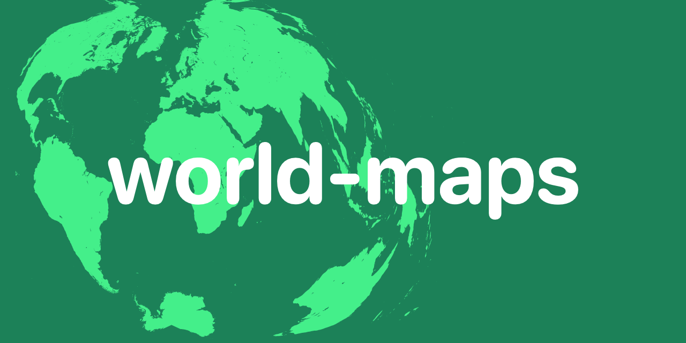
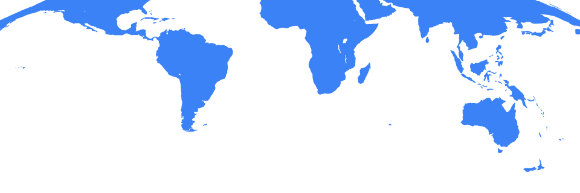

# world-maps

World Maps that I've generated for various purposes, usually for simple
graphics that I cannot otherwise find on the web.

## social_preview.py

## proj_vis_wgs84.py

## proj_vis_background.py

